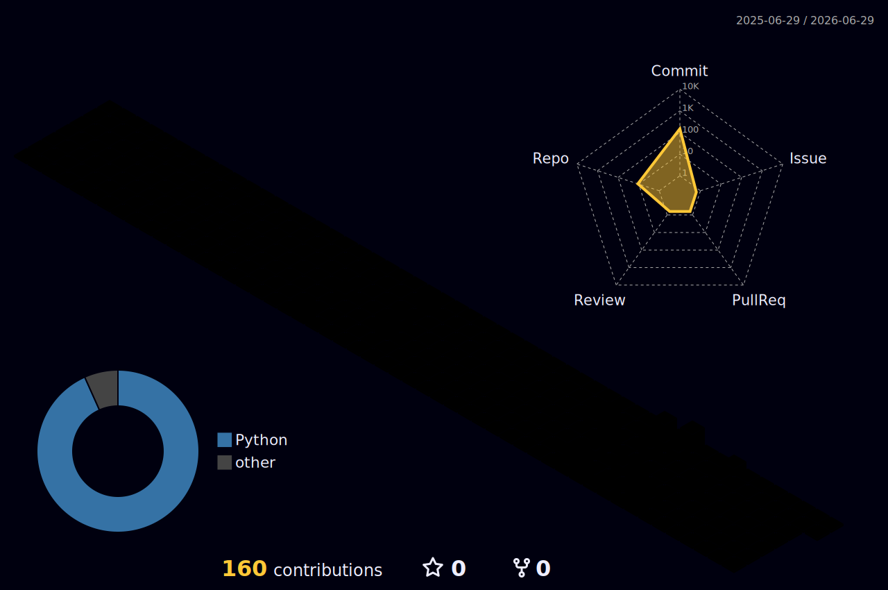

### Hi there 👋

--- 
👋 Hi, I’m @cngchis. I’m a alumnus of [NTTU](https://ntt.edu.vn/).

🔭 I’m interested in information retrieval, large-scale data processing, and distributed systems.

🤖 I’m currently focusing on AI engineering, including machine learning systems, LLM applications, and production-ready AI pipelines.

📫 My email: contact@cngchis.id.vn

🙋‍♂️ More about me: ✨ https://cngchis.id.vn/ 

<!--
**cngchis/cngchis** is a ✨ _special_ ✨ repository because its `README.md` (this file) appears on your GitHub profile.

Here are some ideas to get you started:

- 🔭 I’m currently working on ...
- 🌱 I’m currently learning ...
- 👯 I’m looking to collaborate on ...
- 🤔 I’m looking for help with ...
- 💬 Ask me about ...
- 📫 How to reach me: ...
- 😄 Pronouns: ...
- ⚡ Fun fact: ...
-->

--- 

---

### Other places to find me

---

